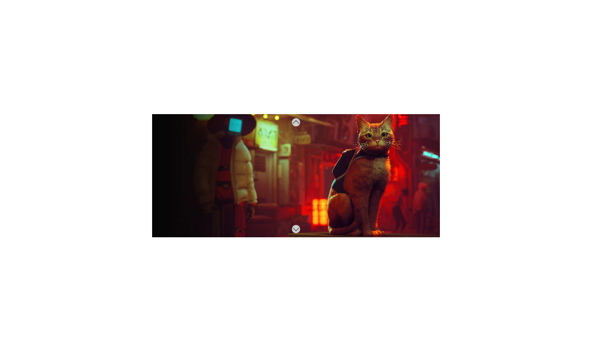

## Consegna:

Dato un array contenente una lista di cinque immagini
Creare un carosello come nello screenshot allegato.

# MILESTONE 1
Per prima cosa, creiamo il markup statico: costruiamo il container e inseriamo un'immagine grande al centro: 
avremo così la struttura base e gli stili pronti per poterci poi concentrare solamente sull'aspetto logico.

- Step 1: creare un layout in HTML
  - container
    - div per img
    - div per next button
    - div per prev button

- Step 2: Sistemare lo style in css

# MILESTONE 2
Adesso rimuoviamo tutto il markup statico e inseriamo tutte le immagini dinamicamente servendoci dell'array fornito e un semplice ciclo for che concatena un template literal. Tutte le immagini saranno nascoste, tranne la prima, che avrà una classe specifica che la renderà visibile. Al termine di questa fase ci ritroveremo con lo stesso slider stilato nella milestone 1, ma costruito dinamicamente attraverso JavaScript.

- Step 3: Creare dinamicamente l'inserimento di immagini
    - Creare l'array per le immaagini

    - Creare una classe che attivi la visione di una sola immagine
        - nel css nascondere tutte le immagini senza la classe di attivazione

    - Creare variabile di partenza che abbia come valore 0 per avere l'immagine di partenza 

    - Ciclare le immagini per aggiungere la classe di attivazione all'immagine successiva

# MILESTONE 3
Al click dell'utente sulle frecce, il programma cambierà l’immagine attiva, che quindi verrà visualizzata al posto della precedente.
 - Step 4: Click sui pulsanti per cambiare immagine

    -take variables of "next" and "prev" button

    - add 2 event listener to click in order to change "active" class throuw the list
        -1 for next => incremetal
        -1 for prev => deremetal
    

## BONUS 1:
Aggiungere il ciclo infinito del carosello. Ovvero se è attiva la prima immagine e l'utente clicca la freccia per andare all’immagine precedente, dovrà comparire l’ultima immagine dell’array e viceversa.

- Step 5: create an infinite carousel loop

    -IF current image is the last one put next image at index 0
    
    - IF you ar at first image put previews image at index 5

## BONUS 2:
Aggiungere la visualizzazione di tutte le thumbnails sulla destra dell’immagine grande attiva, come nello screenshot proposto. Tutte le miniature avranno un layer di opacità scura, tranne quella corrispondente all’immagine attiva, che invece avrà un bordo colorato. Al click delle frecce, oltre al cambio di immagine attiva, gestire il cambio di miniatura attiva.

<!-- Prima di partire a scrivere codice:
Non lasciamoci spaventare dalla complessità apparente dell'esercizio, ma analizziamo prima, come abbiamo fatto sempre, cosa ci potrebbe aspettare. Abbiamo completato ormai da qualche giorno la sessione HTML e CSS, se non ci ricordiamo qualcosa andiamo pure a riguardare alcuni argomenti. Non dedichiamo però al ripasso più di una mezz'ora, così da non perdere di vista il focus dell'esercizio.
Consigli del giorno:
Costruiamo del carosello una versione statica contenente solamente un'immagine. Di questa versione statica al momento opportuno commenteremo (oscureremo) alcuni elementi per poterli riprodurre dinamicamente in js. Potremo quindi usarli come "template".
Scriviamo sempre prima per punti il nostro algoritmo in italiano per capire cosa vogliamo fare
Al momento giusto (ihihhi starà a voi capire quale) rispondete a questa domanda: "Quanti cicli servono?" -->